# Agentsy Data Model Specification

**Author**: Ishwar Prasad
**Date**: March 2026
**Status**: Draft
**Implements**: PRD v1, Technology Decisions
**Stack**: PostgreSQL + Drizzle ORM + pgvector + Row-Level Security

> **Local Development**: The `agentsy dev` CLI command uses a SQLite-compatible subset
> of this schema (via Drizzle's SQLite driver). RLS policies and pgvector features are
> stubbed — local dev uses in-memory vector search and skips tenant isolation. The
> PostgreSQL schema in this document is the production source of truth.

---

## Table of Contents

1. [Conventions](#1-conventions)
2. [Enum Types](#2-enum-types)
3. [Schema Definitions](#3-schema-definitions)
4. [ER Diagram](#4-er-diagram)
5. [Row-Level Security Policies](#5-row-level-security-policies)
6. [Migration Strategy](#6-migration-strategy)

---

## 1. Conventions

### ID Strategy

All primary keys use **prefixed nanoid** strings. This provides:
- Human-readable type identification from the ID alone
- URL-safe characters (no encoding needed)
- Collision resistance equivalent to UUIDv4 at 21 characters
- No sequential enumeration attack surface

| Table | Prefix | Example |
|-------|--------|---------|
| organizations | `org_` | `org_V1StGXR8_Z5jdHi6B` |
| organization_members | `mem_` | `mem_a3k9Xp2mQ7wR` |
| api_keys | `key_` | `key_Tz4Rv8bNq1Lm` |
| agents | `ag_` | `ag_kP9xW2nM5vBz` |
| agent_versions | `ver_` | `ver_qJ3tY8cF6hNm` |
| environments | `env_` | `env_rL7wK4xP2dGs` |
| deployments | `dep_` | `dep_mN5vB9kP3wQx` |
| runs | `run_` | `run_hT2cF8nM6jLz` |
| run_steps | `stp_` | `stp_xW4bN7kP9vRm` |
| sessions | `ses_` | `ses_qJ6tY3cF8hNz` |
| messages | `msg_` | `msg_rL9wK2xP5dGm` |
| eval_datasets | `eds_` | `eds_mN7vB4kP1wQz` |
| eval_dataset_cases | `edc_` | `edc_hT5cF9nM3jLx` |
| eval_experiments | `exp_` | `exp_xW8bN2kP6vRz` |
| eval_experiment_results | `exr_` | `exr_qJ4tY7cF1hNm` |
| eval_baselines | `ebl_` | `ebl_rL3wK8xP4dGz` |
| knowledge_bases | `kb_` | `kb_mN9vB5kP2wQx` |
| knowledge_chunks | `kc_` | `kc_hT7cF3nM8jLz` |
| secrets | `sec_` | `sec_xW6bN4kP7vRm` |
| usage_daily | `usg_` | `usg_qJ8tY5cF2hNx` |
| webhooks | `whk_` | `whk_mN9vB5kP2wQx` |
| connectors | `con_` | `con_gmail` |
| connector_connections | `conn_` | `conn_qJ8tY5cF2hNx` |
| alert_rules | `alr_` | `alr_hT7cF3nM8jLz` |
| notifications | `ntf_` | `ntf_xW6bN4kP7vRm` |
| run_artifacts | `art_` | `art_kP9xW2nM5vBz` |
| agent_repos | `rep_` | `rep_rL7wK4xP2dGs` |
| evolution_sessions | `evo_` | `evo_kP9xW2nM5vBz` |
| evolution_mutations | `mut_` | `mut_qJ3tY8cF6hNm` |

### Nanoid Generator

```typescript
// packages/shared/src/id.ts
import { customAlphabet } from "nanoid";

const alphabet = "0123456789ABCDEFGHIJKLMNOPQRSTUVWXYZabcdefghijklmnopqrstuvwxyz";
const generate = customAlphabet(alphabet, 21);

export type IdPrefix =
  | "org" | "mem" | "key" | "ag" | "ver" | "env" | "dep"
  | "run" | "stp" | "ses" | "msg" | "eds" | "edc" | "exp"
  | "exr" | "ebl" | "kb" | "kc" | "sec" | "usg"
  | "art" | "rep" | "evo" | "mut";

export function newId(prefix: IdPrefix): string {
  return `${prefix}_${generate()}`;
}
```

### Timestamp Conventions

- All timestamps stored as `timestamp with time zone` (`timestamptz`), in UTC.
- Every table has `created_at` (defaulting to `now()`) and `updated_at` (defaulting to `now()`, updated via trigger).
- Tables with soft delete have a nullable `deleted_at` column.
- Application code must never send local times; the database enforces UTC.

### Shared Update Trigger

```sql
-- Applied to every table with updated_at
CREATE OR REPLACE FUNCTION set_updated_at()
RETURNS TRIGGER AS $$
BEGIN
  NEW.updated_at = now();
  RETURN NEW;
END;
$$ LANGUAGE plpgsql;
```

### Soft Delete Strategy

Tables that support soft delete:
- `organizations`, `agents`, `sessions`, `knowledge_bases`, `eval_datasets`
- All other tables use hard delete with cascade from parent.

Soft-deleted rows are excluded by default via RLS policies. A `deleted_at IS NULL` predicate is included in every RLS `USING` clause for soft-delete-enabled tables.

**Cascade behavior for soft-deleted parents:**
- When an `organization` is soft-deleted, its `agents`, `sessions`, `knowledge_bases`, and `eval_datasets` are also soft-deleted (application-level cascade, not DB constraint). Hard-delete children (runs, run_steps, messages, api_keys, etc.) remain intact for audit purposes but become inaccessible via RLS.
- When an `agent` is soft-deleted, its `agent_versions`, `deployments`, `knowledge_bases`, and `connector_connections` remain intact. Runs already completed are unaffected. New runs are rejected at the API layer.
- Permanent cleanup of soft-deleted records (and their children) is handled by the data retention job after the configured retention period.

### JSONB Column Contract

JSONB columns store semi-structured data that varies per use case (guardrails config, tool parameters, grader scores). Each JSONB column has a documented TypeScript type that serves as the schema contract. Application code validates JSONB with Zod before insert.

---

## 2. Enum Types

```typescript
// packages/db/src/schema/enums.ts
import { pgEnum } from "drizzle-orm/pg-core";

export const orgPlanEnum = pgEnum("org_plan", [
  "free",
  "pro",
  "team",
  "enterprise",
]);

export const orgMemberRoleEnum = pgEnum("org_member_role", [
  "admin",
  "member",
]);

export const environmentTypeEnum = pgEnum("environment_type", [
  "development",
  "staging",
  "production",
]);

export const runStatusEnum = pgEnum("run_status", [
  "queued",
  "running",
  "awaiting_approval",  // Run is paused waiting for human approval of a write/admin tool
  "completed",
  "failed",
  "cancelled",
  "timeout",
]);

export const stepTypeEnum = pgEnum("step_type", [
  "llm_call",
  "tool_call",
  "retrieval",
  "guardrail",
  "approval_request",
]);

export const messageRoleEnum = pgEnum("message_role", [
  "system",
  "user",
  "assistant",
  "tool",
]);

export const evalExperimentStatusEnum = pgEnum("eval_experiment_status", [
  "queued",
  "running",
  "completed",
  "failed",
  "cancelled",
]);

export const deploymentStatusEnum = pgEnum("deployment_status", [
  "active",
  "superseded",
  "rolled_back",
]);

export const approvalStatusEnum = pgEnum("approval_status", [
  "pending",
  "approved",
  "denied",
]);

export const alertConditionTypeEnum = pgEnum("alert_condition_type", [
  "error_rate",
  "latency_p95",
  "cost_per_run",
  "run_failure_count",
]);

export const notificationTypeEnum = pgEnum("notification_type", [
  "alert_triggered",
  "approval_requested",
  "deploy_completed",
  "eval_completed",
]);
```

---

## 3. Schema Definitions

### Common Imports

```typescript
// packages/db/src/schema/tables.ts
import {
  pgTable,
  text,
  varchar,
  integer,
  bigint,
  boolean,
  timestamp,
  jsonb,
  index,
  uniqueIndex,
  real,
  doublePrecision,
  date,
  customType,
} from "drizzle-orm/pg-core";
import { sql } from "drizzle-orm";
import {
  orgPlanEnum,
  orgMemberRoleEnum,
  environmentTypeEnum,
  runStatusEnum,
  stepTypeEnum,
  messageRoleEnum,
  evalExperimentStatusEnum,
  deploymentStatusEnum,
} from "./enums";

// Custom type for pgvector
const vector = customType<{ data: number[]; driverParam: string }>({
  dataType(config) {
    return `vector(${config?.dimensions ?? 1536})`;
  },
  toDriver(value: number[]): string {
    return `[${value.join(",")}]`;
  },
  fromDriver(value: string): number[] {
    return value
      .slice(1, -1)
      .split(",")
      .map(Number);
  },
});

// Custom type for tsvector
const tsvector = customType<{ data: string }>({
  dataType() {
    return "tsvector";
  },
});
```

---

### 3.1 organizations

Multi-tenant root. Every piece of data in the system belongs to an organization.

```typescript
export const organizations = pgTable(
  "organizations",
  {
    id: varchar("id", { length: 30 }).primaryKey(), // org_...
    name: varchar("name", { length: 255 }).notNull(),
    slug: varchar("slug", { length: 63 }).notNull(),
    externalAuthId: varchar("external_auth_id", { length: 255 }).notNull(), // Better Auth org ID
    plan: orgPlanEnum("plan").notNull().default("free"),
    billingEmail: varchar("billing_email", { length: 255 }),
    metadata: jsonb("metadata").$type<OrgMetadata>().default({}),
    createdAt: timestamp("created_at", { withTimezone: true })
      .notNull()
      .defaultNow(),
    updatedAt: timestamp("updated_at", { withTimezone: true })
      .notNull()
      .defaultNow(),
    deletedAt: timestamp("deleted_at", { withTimezone: true }),
  },
  (table) => [
    uniqueIndex("organizations_slug_idx").on(table.slug),
    uniqueIndex("organizations_external_auth_id_idx").on(table.externalAuthId),
  ]
);

// JSONB type contract
type OrgMetadata = {
  maxAgents?: number;
  maxRunsPerDay?: number;
  maxTokensPerDay?: number;
  maxConcurrentRuns?: number;
  features?: string[];
  retentionDays?: number; // Default: 90. Configurable per org.
};
```

**RLS**: Rows visible only where `id = current_setting('app.org_id')`. Soft delete: `deleted_at IS NULL`.

---

### 3.2 organization_members

Maps users (from Better Auth) to organizations with roles.

```typescript
export const organizationMembers = pgTable(
  "organization_members",
  {
    id: varchar("id", { length: 30 }).primaryKey(), // mem_...
    orgId: varchar("org_id", { length: 30 })
      .notNull()
      .references(() => organizations.id, { onDelete: "cascade" }),
    userId: varchar("user_id", { length: 255 }).notNull(), // Better Auth user ID
    role: orgMemberRoleEnum("role").notNull().default("member"),
    createdAt: timestamp("created_at", { withTimezone: true })
      .notNull()
      .defaultNow(),
    updatedAt: timestamp("updated_at", { withTimezone: true })
      .notNull()
      .defaultNow(),
  },
  (table) => [
    uniqueIndex("org_members_org_user_idx").on(
      table.orgId,
      table.userId
    ),
    index("org_members_user_id_idx").on(table.userId),
  ]
);
```

**RLS**: Rows visible only where `org_id = current_setting('app.org_id')`.

---

### 3.3 api_keys

Per-organization API keys. The actual key is never stored; only a SHA-256 hash. A short prefix (first 8 chars) is stored in plaintext for lookup and display (`sk-agentsy-...V1St`).

```typescript
export const apiKeys = pgTable(
  "api_keys",
  {
    id: varchar("id", { length: 30 }).primaryKey(), // key_...
    orgId: varchar("org_id", { length: 30 })
      .notNull()
      .references(() => organizations.id, { onDelete: "cascade" }),
    name: varchar("name", { length: 255 }).notNull(),
    prefix: varchar("prefix", { length: 16 }).notNull(), // e.g. "sk-agent"
    keyHash: varchar("key_hash", { length: 64 }).notNull(), // SHA-256 hex
    lastUsedAt: timestamp("last_used_at", { withTimezone: true }),
    expiresAt: timestamp("expires_at", { withTimezone: true }),
    revokedAt: timestamp("revoked_at", { withTimezone: true }),
    createdBy: varchar("created_by", { length: 255 }), // user_id (Better Auth)
    createdAt: timestamp("created_at", { withTimezone: true })
      .notNull()
      .defaultNow(),
    updatedAt: timestamp("updated_at", { withTimezone: true })
      .notNull()
      .defaultNow(),
  },
  (table) => [
    uniqueIndex("api_keys_key_hash_idx").on(table.keyHash),
    index("api_keys_prefix_idx").on(table.prefix),
    index("api_keys_org_id_idx").on(table.orgId),
  ]
);
```

**Authentication flow**:
1. Client sends `Authorization: Bearer sk-agentsy-...`
2. Server extracts prefix, queries by prefix to narrow candidates
3. SHA-256 hashes the full key, matches against `key_hash`
4. Checks `revoked_at IS NULL` and `(expires_at IS NULL OR expires_at > now())`
5. Updates `last_used_at`

**RLS**: Rows visible only where `org_id = current_setting('app.org_id')`.

---

### 3.4 agents

Agent definitions. The agent record is the stable identity; configuration lives in `agent_versions`.

```typescript
export const agents = pgTable(
  "agents",
  {
    id: varchar("id", { length: 30 }).primaryKey(), // ag_...
    orgId: varchar("org_id", { length: 30 })
      .notNull()
      .references(() => organizations.id, { onDelete: "cascade" }),
    name: varchar("name", { length: 255 }).notNull(),
    slug: varchar("slug", { length: 63 }).notNull(),
    description: text("description"),
    createdAt: timestamp("created_at", { withTimezone: true })
      .notNull()
      .defaultNow(),
    updatedAt: timestamp("updated_at", { withTimezone: true })
      .notNull()
      .defaultNow(),
    deletedAt: timestamp("deleted_at", { withTimezone: true }),
  },
  (table) => [
    uniqueIndex("agents_org_slug_idx").on(table.orgId, table.slug),
    index("agents_org_id_idx").on(table.orgId),
  ]
);
```

**RLS**: `org_id = current_setting('app.org_id') AND deleted_at IS NULL`.

---

### 3.5 agent_versions

Immutable snapshots of agent configuration. Each deploy creates a new version. Versions are never mutated after creation.

```typescript
export const agentVersions = pgTable(
  "agent_versions",
  {
    id: varchar("id", { length: 30 }).primaryKey(), // ver_...
    agentId: varchar("agent_id", { length: 30 })
      .notNull()
      .references(() => agents.id, { onDelete: "cascade" }),
    orgId: varchar("org_id", { length: 30 })
      .notNull()
      .references(() => organizations.id, { onDelete: "cascade" }),
    version: integer("version").notNull(), // monotonically increasing per agent
    // For dynamic prompts (SDK's SystemPromptFn), the SDK evaluates the function
    // at deploy time and stores the rendered string. At runtime, template variables
    // like {{currentDate}} are re-evaluated per-run by the runtime engine.
    // The stored string may contain template placeholders: "Today is {{currentDate}}"
    systemPrompt: text("system_prompt").notNull(),
    // model stores the resolved model name at deploy time. modelSpec stores the
    // original configuration. When modelSpec.type is 'class', the platform
    // re-resolves on each run.
    model: varchar("model", { length: 100 }).notNull(), // e.g. "claude-sonnet-4"
    modelSpec: jsonb("model_spec").$type<ModelSpec>(),
    fallbackModel: varchar("fallback_model", { length: 100 }),
    toolsConfig: jsonb("tools_config").$type<ToolsConfig>().notNull().default([]),
    guardrailsConfig: jsonb("guardrails_config")
      .$type<GuardrailsConfig>()
      .notNull()
      .default({}),
    modelParams: jsonb("model_params").$type<ModelParams>().default({}),
    outputConfig: jsonb("output_config").$type<ResponseOutputConfig>().notNull().default({ mode: "text" }), // Phase 4.5: response contract
    description: text("description"), // changelog / commit message for this version
    createdBy: varchar("created_by", { length: 255 }), // user_id (Better Auth)
    createdAt: timestamp("created_at", { withTimezone: true })
      .notNull()
      .defaultNow(),
  },
  (table) => [
    uniqueIndex("agent_versions_agent_version_idx").on(
      table.agentId,
      table.version
    ),
    index("agent_versions_agent_id_idx").on(table.agentId),
    index("agent_versions_org_id_idx").on(table.orgId),
  ]
);

// JSONB type contracts
type ModelSpec =
  | { type: "direct"; model: string }  // Pinned to specific model
  | { type: "class"; class: "reasoning" | "balanced" | "fast"; provider?: "anthropic" | "openai" };

type ToolsConfig = Array<{
  name: string;
  type: "native" | "mcp";
  description?: string;
  inputSchema?: Record<string, unknown>;
  mcpServerUrl?: string;
  mcpTransport?: "stdio" | "streamable-http";
  timeout?: number;
  riskLevel?: "read" | "write" | "admin";  // Default: "read"
  approvalPolicy?: {
    autoApprove?: boolean;
    requireApproval?: boolean;
    requireApprovalIn?: Array<"development" | "staging" | "production">;
  };
}>;

type GuardrailsConfig = {
  maxIterations?: number; // default: 10
  maxTokens?: number; // default: 50_000
  timeoutMs?: number; // default: 300_000 (5 min)
  maxToolResultSize?: number; // default: 10_240 (10KB)
  outputValidation?: Array<{
    type: "no_pii" | "on_topic" | "content_policy" | "custom";
    config?: Record<string, unknown>;
  }>;
};

type ModelParams = {
  temperature?: number;
  topP?: number;
  maxOutputTokens?: number;
  stopSequences?: string[];
};

// Phase 4.5: Response output contract
type ResponseOutputConfig = {
  mode: "text" | "json";              // Default: "text"
  json_schema?: Record<string, unknown>; // JSON Schema; only valid when mode="json"
  strict?: boolean;                    // true → fail run on validation error; false → completed with output_valid=false
  schema_version?: string;             // Forward compat; default "1"
};

// Validation result stored on runs + run_steps
type OutputValidationResult = {
  ok: boolean;
  errors?: Array<{ path: string; message: string }>;
};
```

**Note**: No `updated_at` because versions are immutable. No soft delete; versions are permanent records.

**RLS**: `org_id = current_setting('app.org_id')`.

---

### 3.6 environments

Per-organization environment definitions. Pre-seeded with `development`, `staging`, `production` on org creation.

```typescript
export const environments = pgTable(
  "environments",
  {
    id: varchar("id", { length: 30 }).primaryKey(), // env_...
    orgId: varchar("org_id", { length: 30 })
      .notNull()
      .references(() => organizations.id, { onDelete: "cascade" }),
    name: environmentTypeEnum("name").notNull(),
    toolAllowList: jsonb("tool_allow_list").$type<string[] | null>(),
      // If null, all tools are allowed. If set, only these tool names can execute.
      // Example: ["get_order", "get_refund_policy"] — blocks write tools in staging.
    toolDenyList: jsonb("tool_deny_list").$type<string[] | null>(),
      // If set, these tools are explicitly blocked (takes precedence over allow list).
    requireApprovalForWriteTools: boolean("require_approval_for_write_tools")
      .notNull()
      .default(false),
      // If true, all tools with riskLevel "write" or "admin" require human approval in this environment.
    createdAt: timestamp("created_at", { withTimezone: true })
      .notNull()
      .defaultNow(),
    updatedAt: timestamp("updated_at", { withTimezone: true })
      .notNull()
      .defaultNow(),
  },
  (table) => [
    uniqueIndex("environments_org_name_idx").on(table.orgId, table.name),
  ]
);
```

**RLS**: `org_id = current_setting('app.org_id')`.

---

### 3.7 deployments

Tracks which agent version is deployed to which environment. The `active` deployment per agent+environment pair is the one currently receiving traffic.

```typescript
export const deployments = pgTable(
  "deployments",
  {
    id: varchar("id", { length: 30 }).primaryKey(), // dep_...
    orgId: varchar("org_id", { length: 30 })
      .notNull()
      .references(() => organizations.id, { onDelete: "cascade" }),
    agentId: varchar("agent_id", { length: 30 })
      .notNull()
      .references(() => agents.id, { onDelete: "cascade" }),
    versionId: varchar("version_id", { length: 30 })
      .notNull()
      .references(() => agentVersions.id, { onDelete: "restrict" }),
    environmentId: varchar("environment_id", { length: 30 })
      .notNull()
      .references(() => environments.id, { onDelete: "cascade" }),
    status: deploymentStatusEnum("status").notNull().default("active"),
    deployedBy: varchar("deployed_by", { length: 255 }), // user_id (Better Auth)
    deployedAt: timestamp("deployed_at", { withTimezone: true })
      .notNull()
      .defaultNow(),
    supersededAt: timestamp("superseded_at", { withTimezone: true }),
    createdAt: timestamp("created_at", { withTimezone: true })
      .notNull()
      .defaultNow(),
  },
  (table) => [
    // Fast lookup: which version is active for this agent in this environment?
    index("deployments_active_lookup_idx")
      .on(table.agentId, table.environmentId, table.status),
    index("deployments_org_id_idx").on(table.orgId),
    index("deployments_agent_id_idx").on(table.agentId),
  ]
);
```

**Deployment flow**:
1. New deployment created with `status = 'active'`.
2. Previous active deployment for the same agent+environment is set to `status = 'superseded'` and `superseded_at = now()`.
3. Rollback: create a new deployment pointing at an older version.

**RLS**: `org_id = current_setting('app.org_id')`.

---

### 3.8 sessions

Multi-turn conversation containers. A session groups multiple runs into a coherent conversation thread.

```typescript
export const sessions = pgTable(
  "sessions",
  {
    id: varchar("id", { length: 30 }).primaryKey(), // ses_...
    orgId: varchar("org_id", { length: 30 })
      .notNull()
      .references(() => organizations.id, { onDelete: "cascade" }),
    agentId: varchar("agent_id", { length: 30 })
      .notNull()
      .references(() => agents.id, { onDelete: "cascade" }),
    metadata: jsonb("metadata").$type<SessionMetadata>().default({}),
    createdAt: timestamp("created_at", { withTimezone: true })
      .notNull()
      .defaultNow(),
    updatedAt: timestamp("updated_at", { withTimezone: true })
      .notNull()
      .defaultNow(),
    deletedAt: timestamp("deleted_at", { withTimezone: true }),
  },
  (table) => [
    index("sessions_org_id_idx").on(table.orgId),
    index("sessions_agent_id_idx").on(table.agentId),
    index("sessions_created_at_idx").on(table.createdAt),
  ]
);

type SessionMetadata = {
  userId?: string; // the end-user (customer of our customer)
  channel?: string; // "web", "api", "slack", etc.
  [key: string]: unknown;
};
```

**RLS**: `org_id = current_setting('app.org_id') AND deleted_at IS NULL`.

---

### 3.9 runs

Agent executions. This is the central observability record. Every invocation of an agent creates a run, whether it comes from the API, eval engine, or playground.

```typescript
export const runs = pgTable(
  "runs",
  {
    id: varchar("id", { length: 30 }).primaryKey(), // run_...
    orgId: varchar("org_id", { length: 30 })
      .notNull()
      .references(() => organizations.id, { onDelete: "cascade" }),
    agentId: varchar("agent_id", { length: 30 })
      .notNull()
      .references(() => agents.id, { onDelete: "cascade" }),
    versionId: varchar("version_id", { length: 30 })
      .references(() => agentVersions.id, { onDelete: "set null" }),
    sessionId: varchar("session_id", { length: 30 })
      .references(() => sessions.id, { onDelete: "set null" }),
    parentRunId: varchar("parent_run_id", { length: 30 })
      .references(() => runs.id, { onDelete: "set null" }),
    environmentId: varchar("environment_id", { length: 30 })
      .notNull()
      .references(() => environments.id, { onDelete: "restrict" }),
    status: runStatusEnum("status").notNull().default("queued"),
    input: jsonb("input").$type<RunInput>().notNull(), // structured input envelope
    output: jsonb("output").$type<RunOutput>(), // structured output envelope
    error: text("error"), // error message if failed
    totalTokensIn: integer("total_tokens_in").notNull().default(0),
    totalTokensOut: integer("total_tokens_out").notNull().default(0),
    totalCostUsd: doublePrecision("total_cost_usd").notNull().default(0),
    durationMs: integer("duration_ms"),
    model: varchar("model", { length: 100 }), // primary model used
    temporalWorkflowId: varchar("temporal_workflow_id", { length: 255 }),
    traceId: varchar("trace_id", { length: 64 }), // OpenTelemetry trace ID
    outputValid: boolean("output_valid"), // Phase 4.5: null = text mode or legacy; true/false for json mode
    outputValidation: jsonb("output_validation").$type<OutputValidationResult>(), // Phase 4.5: { ok, errors? } when mode=json
    metadata: jsonb("metadata").$type<RunMetadata>().default({}),
    startedAt: timestamp("started_at", { withTimezone: true }),
    completedAt: timestamp("completed_at", { withTimezone: true }),
    createdAt: timestamp("created_at", { withTimezone: true })
      .notNull()
      .defaultNow(),
    updatedAt: timestamp("updated_at", { withTimezone: true })
      .notNull()
      .defaultNow(),
  },
  (table) => [
    index("runs_org_id_idx").on(table.orgId),
    index("runs_agent_id_idx").on(table.agentId),
    index("runs_session_id_idx").on(table.sessionId),
    index("runs_parent_run_id_idx").on(table.parentRunId),
    index("runs_status_idx").on(table.status),
    index("runs_created_at_idx").on(table.createdAt),
    index("runs_trace_id_idx").on(table.traceId),
    // Composite for dashboard queries: recent runs per agent filtered by status
    index("runs_agent_status_created_idx").on(
      table.agentId,
      table.status,
      table.createdAt
    ),
    // Composite for cost analysis: per-org, per-day
    index("runs_org_created_idx").on(table.orgId, table.createdAt),
    // Composite for per-environment queries (dashboard filtering)
    index("runs_org_env_created_idx").on(table.orgId, table.environmentId, table.createdAt),
  ]
);

/**
 * Structured input envelope — preserves message arrays for replay, diffing, and evals.
 * Plain string inputs are wrapped as { type: "text", text: "..." } for consistency.
 */
type RunInput =
  | { type: "text"; text: string }
  | { type: "messages"; messages: Array<{ role: string; content: string }> }
  | { type: "structured"; data: Record<string, unknown> };

/**
 * Structured output envelope — preserves tool call results and multi-part responses.
 */
type RunOutput =
  | { type: "text"; text: string }
  | { type: "messages"; messages: Array<{ role: string; content: string }> }
  | { type: "structured"; data: Record<string, unknown> };

type RunMetadata = {
  source?: "api" | "playground" | "eval" | "cli";
  apiKeyId?: string;
  userAgent?: string;
  ip?: string;
  [key: string]: unknown;
};
```

**RLS**: `org_id = current_setting('app.org_id')`.

---

### 3.10 run_steps

Individual steps within a run. Each LLM call, tool call, or retrieval operation is a separate step. Steps form a flat ordered list (not a tree) within a run.

```typescript
export const runSteps = pgTable(
  "run_steps",
  {
    id: varchar("id", { length: 30 }).primaryKey(), // stp_...
    runId: varchar("run_id", { length: 30 })
      .notNull()
      .references(() => runs.id, { onDelete: "cascade" }),
    orgId: varchar("org_id", { length: 30 })
      .notNull()
      .references(() => organizations.id, { onDelete: "cascade" }),
    stepOrder: integer("step_order").notNull(), // 0-indexed position
    type: stepTypeEnum("type").notNull(),
    model: varchar("model", { length: 100 }), // for llm_call steps
    toolName: varchar("tool_name", { length: 255 }), // for tool_call steps
    input: text("input"), // prompt or tool arguments
    output: text("output"), // response or tool result
    tokensIn: integer("tokens_in").notNull().default(0),
    tokensOut: integer("tokens_out").notNull().default(0),
    costUsd: doublePrecision("cost_usd").notNull().default(0),
    durationMs: integer("duration_ms"),
    error: text("error"),
    outputTruncated: boolean("output_truncated").notNull().default(false), // true when tool result exceeded 10KB and was truncated
    approvalStatus: approvalStatusEnum("approval_status"), // null for non-approval steps
    approvalResolvedBy: varchar("approval_resolved_by", { length: 255 }), // user_id (Better Auth)
    approvalResolvedAt: timestamp("approval_resolved_at", { withTimezone: true }),
    approvalWaitStartedAt: timestamp("approval_wait_started_at", { withTimezone: true }), // for measuring approval latency
    parsedOutput: jsonb("parsed_output"), // Phase 4.5: parsed JSON object (json mode only, final LLM step)
    outputValidation: jsonb("output_validation").$type<OutputValidationResult>(), // Phase 4.5: { ok, errors? } (json mode only)
    metadata: jsonb("metadata").$type<StepMetadata>().default({}),
    startedAt: timestamp("started_at", { withTimezone: true }),
    completedAt: timestamp("completed_at", { withTimezone: true }),
    createdAt: timestamp("created_at", { withTimezone: true })
      .notNull()
      .defaultNow(),
  },
  (table) => [
    // Unique constraint prevents duplicate step positions under retries/concurrent writes
    uniqueIndex("run_steps_run_id_order_idx").on(table.runId, table.stepOrder),
    index("run_steps_org_id_idx").on(table.orgId),
    index("run_steps_type_idx").on(table.type),
  ]
);

type StepMetadata = {
  spanId?: string; // OTel span ID
  cacheHit?: boolean;
  retryCount?: number;
  toolCallId?: string; // LLM-provided tool_call_id
  [key: string]: unknown;
};
```

**Note**: No `updated_at` — steps are append-only once completed.

**RLS**: `org_id = current_setting('app.org_id')`.

---

### 3.11 messages

Conversation messages within a session. Messages are the user-visible conversation history, distinct from run_steps which are the internal execution trace.

```typescript
export const messages = pgTable(
  "messages",
  {
    id: varchar("id", { length: 30 }).primaryKey(), // msg_...
    sessionId: varchar("session_id", { length: 30 })
      .notNull()
      .references(() => sessions.id, { onDelete: "cascade" }),
    orgId: varchar("org_id", { length: 30 })
      .notNull()
      .references(() => organizations.id, { onDelete: "cascade" }),
    runId: varchar("run_id", { length: 30 })
      .references(() => runs.id, { onDelete: "set null" }),
    role: messageRoleEnum("role").notNull(),
    content: text("content").notNull(),
    toolCallId: varchar("tool_call_id", { length: 255 }), // for tool role messages
    toolName: varchar("tool_name", { length: 255 }), // for tool role messages
    messageOrder: integer("message_order").notNull(), // position in session
    metadata: jsonb("metadata").$type<MessageMetadata>().default({}),
    createdAt: timestamp("created_at", { withTimezone: true })
      .notNull()
      .defaultNow(),
  },
  (table) => [
    // Unique constraint prevents duplicate message positions within a session
    uniqueIndex("messages_session_order_idx").on(
      table.sessionId,
      table.messageOrder
    ),
    index("messages_org_id_idx").on(table.orgId),
    index("messages_run_id_idx").on(table.runId),
  ]
);

type MessageMetadata = {
  tokenCount?: number;
  truncated?: boolean;
  [key: string]: unknown;
};
```

**RLS**: `org_id = current_setting('app.org_id')`.

---

### 3.12 eval_datasets

Versioned collections of test cases. Datasets are immutable snapshots — to update a dataset, create a new version.

```typescript
export const evalDatasets = pgTable(
  "eval_datasets",
  {
    id: varchar("id", { length: 30 }).primaryKey(), // eds_...
    orgId: varchar("org_id", { length: 30 })
      .notNull()
      .references(() => organizations.id, { onDelete: "cascade" }),
    name: varchar("name", { length: 255 }).notNull(),
    description: text("description"),
    version: integer("version").notNull().default(1),
    caseCount: integer("case_count").notNull().default(0),
    createdBy: varchar("created_by", { length: 255 }), // user_id (Better Auth)
    createdAt: timestamp("created_at", { withTimezone: true })
      .notNull()
      .defaultNow(),
    updatedAt: timestamp("updated_at", { withTimezone: true })
      .notNull()
      .defaultNow(),
    deletedAt: timestamp("deleted_at", { withTimezone: true }),
  },
  (table) => [
    uniqueIndex("eval_datasets_org_name_version_idx").on(
      table.orgId,
      table.name,
      table.version
    ),
    index("eval_datasets_org_id_idx").on(table.orgId),
  ]
);
```

**RLS**: `org_id = current_setting('app.org_id') AND deleted_at IS NULL`.

---

### 3.13 eval_dataset_cases

Individual test cases within a dataset.

```typescript
export const evalDatasetCases = pgTable(
  "eval_dataset_cases",
  {
    id: varchar("id", { length: 30 }).primaryKey(), // edc_...
    datasetId: varchar("dataset_id", { length: 30 })
      .notNull()
      .references(() => evalDatasets.id, { onDelete: "cascade" }),
    orgId: varchar("org_id", { length: 30 })
      .notNull()
      .references(() => organizations.id, { onDelete: "cascade" }),
    input: jsonb("input").$type<RunInput>().notNull(), // structured input (same envelope as runs.input)
    expectedOutput: jsonb("expected_output").$type<RunOutput>(), // structured expected response
    expectedToolCalls: jsonb("expected_tool_calls")
      .$type<ExpectedToolCall[]>()
      .default([]),
    metadata: jsonb("metadata").$type<Record<string, unknown>>().default({}),
    mockedToolResults: jsonb("mocked_tool_results")
      .$type<MockedToolResult[]>()
      .default([]),
    sessionHistory: jsonb("session_history")
      .$type<Array<{ role: string; content: string }>>()
      .default([]),
    expectedTrajectory: jsonb("expected_trajectory")
      .$type<TrajectoryStep[]>()
      .default([]),
    expectedApprovalBehavior: jsonb("expected_approval_behavior")
      .$type<ApprovalExpectation>(),
    expectedCitations: jsonb("expected_citations")
      .$type<string[]>()
      .default([]),
    expectedMemoryWrites: jsonb("expected_memory_writes")
      .$type<MemoryExpectation[]>()
      .default([]),
    tags: jsonb("tags").$type<string[]>().default([]),
    caseOrder: integer("case_order").notNull().default(0),
    createdAt: timestamp("created_at", { withTimezone: true })
      .notNull()
      .defaultNow(),
  },
  (table) => [
    index("eval_dataset_cases_dataset_id_idx").on(table.datasetId),
    index("eval_dataset_cases_org_id_idx").on(table.orgId),
    index("eval_dataset_cases_tags_idx").using("gin", table.tags),
  ]
);

type ExpectedToolCall = {
  name: string;
  arguments?: Record<string, unknown>;
  order?: number; // expected position in tool call sequence
};

type MockedToolResult = {
  toolName: string;
  argumentsMatch?: Record<string, unknown>; // match criteria
  result: unknown; // the mocked return value
};

type TrajectoryStep = {
  type: "tool_call" | "response" | "approval_request";
  toolName?: string;
  contains?: string;  // Substring match on response text
};

type ApprovalExpectation = {
  shouldRequest: boolean;
  toolName?: string;
  action?: "approve" | "deny";  // Mock the human decision in eval
};

type MemoryExpectation = {
  type: "session_write" | "knowledge_update";
  key?: string;
  valueContains?: string;
};
```

**RLS**: `org_id = current_setting('app.org_id')`.

---

### 3.14 eval_experiments

Experiment runs — executing an agent against a dataset and collecting results.

```typescript
export const evalExperiments = pgTable(
  "eval_experiments",
  {
    id: varchar("id", { length: 30 }).primaryKey(), // exp_...
    orgId: varchar("org_id", { length: 30 })
      .notNull()
      .references(() => organizations.id, { onDelete: "cascade" }),
    datasetId: varchar("dataset_id", { length: 30 })
      .notNull()
      .references(() => evalDatasets.id, { onDelete: "cascade" }),
    agentId: varchar("agent_id", { length: 30 })
      .notNull()
      .references(() => agents.id, { onDelete: "cascade" }),
    versionId: varchar("version_id", { length: 30 })
      .notNull()
      .references(() => agentVersions.id, { onDelete: "cascade" }),
    name: varchar("name", { length: 255 }),
    status: evalExperimentStatusEnum("status").notNull().default("queued"),
    summaryScores: jsonb("summary_scores")
      .$type<Record<string, number>>()
      .default({}),
    totalCases: integer("total_cases").notNull().default(0),
    passedCases: integer("passed_cases").notNull().default(0),
    failedCases: integer("failed_cases").notNull().default(0),
    totalCostUsd: doublePrecision("total_cost_usd").notNull().default(0),
    totalDurationMs: integer("total_duration_ms"),
    config: jsonb("config").$type<ExperimentConfig>().default({}),
    error: text("error"),
    startedAt: timestamp("started_at", { withTimezone: true }),
    completedAt: timestamp("completed_at", { withTimezone: true }),
    // CI/CD context — links experiment to the commit/PR that triggered it
    commitSha: varchar("commit_sha", { length: 40 }),
    prNumber: integer("pr_number"),
    ciRunUrl: varchar("ci_run_url", { length: 500 }),
    createdBy: varchar("created_by", { length: 255 }), // user_id (Better Auth)
    createdAt: timestamp("created_at", { withTimezone: true })
      .notNull()
      .defaultNow(),
    updatedAt: timestamp("updated_at", { withTimezone: true })
      .notNull()
      .defaultNow(),
  },
  (table) => [
    index("eval_experiments_org_id_idx").on(table.orgId),
    index("eval_experiments_dataset_id_idx").on(table.datasetId),
    index("eval_experiments_agent_id_idx").on(table.agentId),
    index("eval_experiments_version_id_idx").on(table.versionId),
    index("eval_experiments_created_at_idx").on(table.createdAt),
    // Composite for finding latest experiment per agent+dataset (baseline comparisons)
    index("eval_experiments_agent_dataset_created_idx").on(
      table.agentId,
      table.datasetId,
      table.createdAt
    ),
  ]
);

type ExperimentConfig = {
  toolMode?: "mock" | "dry-run" | "live";
  graders?: Array<{
    name: string;
    type: "exact_match" | "json_schema" | "regex" | "numeric_threshold"
      | "embedding_similarity" | "tool_name_match" | "tool_args_match"
      | "llm_judge" | "tool_sequence" | "unnecessary_steps" | "custom";
    config?: Record<string, unknown>;
  }>;
  parallelism?: number;
  judgeModel?: string;
};
```

**RLS**: `org_id = current_setting('app.org_id')`.

---

### 3.15 eval_experiment_results

Per-case results within an experiment.

```typescript
export const evalExperimentResults = pgTable(
  "eval_experiment_results",
  {
    id: varchar("id", { length: 30 }).primaryKey(), // exr_...
    experimentId: varchar("experiment_id", { length: 30 })
      .notNull()
      .references(() => evalExperiments.id, { onDelete: "cascade" }),
    caseId: varchar("case_id", { length: 30 })
      .notNull()
      .references(() => evalDatasetCases.id, { onDelete: "cascade" }),
    orgId: varchar("org_id", { length: 30 })
      .notNull()
      .references(() => organizations.id, { onDelete: "cascade" }),
    runId: varchar("run_id", { length: 30 })
      .references(() => runs.id, { onDelete: "set null" }),
    output: text("output"), // actual agent output
    scores: jsonb("scores").$type<Record<string, ScoreResult>>().default({}),
    passed: boolean("passed"),
    durationMs: integer("duration_ms"),
    costUsd: doublePrecision("cost_usd").notNull().default(0),
    error: text("error"),
    createdAt: timestamp("created_at", { withTimezone: true })
      .notNull()
      .defaultNow(),
  },
  (table) => [
    index("eval_experiment_results_experiment_id_idx").on(table.experimentId),
    index("eval_experiment_results_case_id_idx").on(table.caseId),
    index("eval_experiment_results_org_id_idx").on(table.orgId),
    // GIN index on scores JSONB for filtering by score values
    index("eval_experiment_results_scores_gin_idx")
      .on(table.scores)
      .using("gin"),
  ]
);

type ScoreResult = {
  score: number; // 0.0 - 1.0
  name: string;
  graderType: string;
  reasoning?: string; // LLM judge explanation
  metadata?: Record<string, unknown>;
};
```

**RLS**: `org_id = current_setting('app.org_id')`.

---

### 3.16 eval_baselines

Stored baseline scores for regression detection. Each baseline is a snapshot of an experiment's scores, used to compare future experiments against.

```typescript
export const evalBaselines = pgTable(
  "eval_baselines",
  {
    id: varchar("id", { length: 30 }).primaryKey(), // ebl_...
    orgId: varchar("org_id", { length: 30 })
      .notNull()
      .references(() => organizations.id, { onDelete: "cascade" }),
    agentId: varchar("agent_id", { length: 30 })
      .notNull()
      .references(() => agents.id, { onDelete: "cascade" }),
    datasetId: varchar("dataset_id", { length: 30 })
      .notNull()
      .references(() => evalDatasets.id, { onDelete: "cascade" }),
    experimentId: varchar("experiment_id", { length: 30 })
      .notNull()
      .references(() => evalExperiments.id, { onDelete: "cascade" }),
    versionId: varchar("version_id", { length: 30 })
      .notNull()
      .references(() => agentVersions.id, { onDelete: "cascade" }),
    summaryScores: jsonb("summary_scores")
      .$type<Record<string, number>>()
      .notNull(),
    perCaseScores: jsonb("per_case_scores")
      .$type<Record<string, Record<string, number>>>() // case_id -> grader_name -> score
      .notNull(),
    isActive: boolean("is_active").notNull().default(true),
    setBy: varchar("set_by", { length: 255 }), // user_id (Better Auth)
    createdAt: timestamp("created_at", { withTimezone: true })
      .notNull()
      .defaultNow(),
  },
  (table) => [
    // Fast lookup: active baseline for a given agent + dataset
    // Partial unique index: only one active baseline per agent+dataset
    uniqueIndex("eval_baselines_active_unique_idx")
      .on(table.agentId, table.datasetId)
      .where(sql`is_active = true`),
    index("eval_baselines_org_id_idx").on(table.orgId),
  ]
);
```

**Baseline flow**:
1. After a successful experiment, user promotes it to baseline.
2. Previous active baseline for the same agent+dataset is set to `is_active = false`.
3. CI integration compares new experiment scores against the active baseline.

**RLS**: `org_id = current_setting('app.org_id')`.

---

### 3.17 knowledge_bases

Per-agent document collections for RAG retrieval.

```typescript
export const knowledgeBases = pgTable(
  "knowledge_bases",
  {
    id: varchar("id", { length: 30 }).primaryKey(), // kb_...
    orgId: varchar("org_id", { length: 30 })
      .notNull()
      .references(() => organizations.id, { onDelete: "cascade" }),
    agentId: varchar("agent_id", { length: 30 })
      .notNull()
      .references(() => agents.id, { onDelete: "cascade" }),
    name: varchar("name", { length: 255 }).notNull(),
    description: text("description"),
    embeddingModel: varchar("embedding_model", { length: 100 })
      .notNull()
      .default("text-embedding-3-small"),
    embeddingDimensions: integer("embedding_dimensions")
      .notNull()
      .default(1536),
    chunkSize: integer("chunk_size").notNull().default(512), // tokens
    chunkOverlap: integer("chunk_overlap").notNull().default(64), // tokens
    totalChunks: integer("total_chunks").notNull().default(0),
    totalDocuments: integer("total_documents").notNull().default(0),
    totalSizeBytes: bigint("total_size_bytes", { mode: "number" })
      .notNull()
      .default(0),
    createdAt: timestamp("created_at", { withTimezone: true })
      .notNull()
      .defaultNow(),
    updatedAt: timestamp("updated_at", { withTimezone: true })
      .notNull()
      .defaultNow(),
    deletedAt: timestamp("deleted_at", { withTimezone: true }),
  },
  (table) => [
    index("knowledge_bases_org_id_idx").on(table.orgId),
    index("knowledge_bases_agent_id_idx").on(table.agentId),
  ]
);
```

**RLS**: `org_id = current_setting('app.org_id') AND deleted_at IS NULL`.

---

### 3.18 knowledge_chunks

Chunked documents with pgvector embeddings and tsvector for hybrid search.

```typescript
export const knowledgeChunks = pgTable(
  "knowledge_chunks",
  {
    id: varchar("id", { length: 30 }).primaryKey(), // kc_...
    knowledgeBaseId: varchar("knowledge_base_id", { length: 30 })
      .notNull()
      .references(() => knowledgeBases.id, { onDelete: "cascade" }),
    orgId: varchar("org_id", { length: 30 })
      .notNull()
      .references(() => organizations.id, { onDelete: "cascade" }),
    documentName: varchar("document_name", { length: 1024 }).notNull(),
    documentHash: varchar("document_hash", { length: 64 }).notNull(), // SHA-256 of source doc
    chunkIndex: integer("chunk_index").notNull(), // position within document
    content: text("content").notNull(),
    embedding: vector("embedding", { dimensions: 1536 }),
    tsv: tsvector("tsv"), // generated tsvector for full-text search
    tokenCount: integer("token_count").notNull().default(0),
    embeddingModel: varchar("embedding_model", { length: 100 }), // e.g., "text-embedding-3-small" — enables re-embedding when model changes
    embeddedAt: timestamp("embedded_at", { withTimezone: true }), // when embedding was last generated
    metadata: jsonb("metadata").$type<ChunkMetadata>().default({}),
    createdAt: timestamp("created_at", { withTimezone: true })
      .notNull()
      .defaultNow(),
  },
  (table) => [
    index("knowledge_chunks_kb_id_idx").on(table.knowledgeBaseId),
    index("knowledge_chunks_org_id_idx").on(table.orgId),
    index("knowledge_chunks_doc_hash_idx").on(table.documentHash),
    // HNSW index for vector similarity search (cosine distance)
    index("knowledge_chunks_embedding_hnsw_idx")
      .on(table.embedding)
      .using("hnsw")
      .with({ m: 16, ef_construction: 64 }),
    // GiST index for full-text search
    index("knowledge_chunks_tsv_gist_idx")
      .on(table.tsv)
      .using("gist"),
  ]
);

type ChunkMetadata = {
  sourceType?: "pdf" | "txt" | "md" | "csv";
  pageNumber?: number;
  section?: string;
  headings?: string[];
  [key: string]: unknown;
};
```

**tsvector generation** (via trigger or generated column):

```sql
-- Trigger to auto-generate tsvector on insert/update
CREATE OR REPLACE FUNCTION knowledge_chunks_tsv_trigger()
RETURNS TRIGGER AS $$
BEGIN
  NEW.tsv := to_tsvector('english', NEW.content);
  RETURN NEW;
END;
$$ LANGUAGE plpgsql;

CREATE TRIGGER knowledge_chunks_tsv_update
  BEFORE INSERT OR UPDATE OF content ON knowledge_chunks
  FOR EACH ROW
  EXECUTE FUNCTION knowledge_chunks_tsv_trigger();
```

**Hybrid search query pattern**:

```sql
-- Reciprocal Rank Fusion (RRF) combining vector + keyword search
WITH vector_results AS (
  SELECT id, content, 1.0 / (60 + ROW_NUMBER() OVER (ORDER BY embedding <=> $1)) AS rrf_score
  FROM knowledge_chunks
  WHERE knowledge_base_id = $2 AND org_id = $3
  ORDER BY embedding <=> $1
  LIMIT 20
),
keyword_results AS (
  SELECT id, content, 1.0 / (60 + ROW_NUMBER() OVER (ORDER BY ts_rank(tsv, query) DESC)) AS rrf_score
  FROM knowledge_chunks, plainto_tsquery('english', $4) query
  WHERE knowledge_base_id = $2 AND org_id = $3 AND tsv @@ query
  ORDER BY ts_rank(tsv, query) DESC
  LIMIT 20
)
SELECT
  COALESCE(v.id, k.id) AS id,
  COALESCE(v.content, k.content) AS content,
  COALESCE(v.rrf_score, 0) + COALESCE(k.rrf_score, 0) AS combined_score
FROM vector_results v
FULL OUTER JOIN keyword_results k ON v.id = k.id
ORDER BY combined_score DESC
LIMIT 10;
```

**RLS**: `org_id = current_setting('app.org_id')`.

---

### 3.19 tenant_secrets

Stores tool credentials encrypted at the application layer (AES-256-GCM). Secret values are encrypted before writing and decrypted at tool-call time by the worker. The API never returns plaintext values — secrets are write-only.

```typescript
export const tenantSecrets = pgTable(
  "tenant_secrets",
  {
    id: varchar("id", { length: 30 }).primaryKey(), // sec_...
    orgId: varchar("org_id", { length: 30 })
      .notNull()
      .references(() => organizations.id, { onDelete: "cascade" }),
    name: varchar("name", { length: 255 }).notNull(), // display name
    key: varchar("key", { length: 255 }).notNull(), // lookup key (e.g., "SLACK_API_TOKEN")
    encryptedValue: text("encrypted_value").notNull(), // AES-256-GCM ciphertext (base64)
    iv: varchar("iv", { length: 32 }).notNull(), // per-secret random IV (hex)
    environment: environmentTypeEnum("environment").notNull(),
    description: text("description"),
    lastRotatedAt: timestamp("last_rotated_at", { withTimezone: true }),
    lastAccessedAt: timestamp("last_accessed_at", { withTimezone: true }),
    createdBy: varchar("created_by", { length: 255 }), // user_id
    createdAt: timestamp("created_at", { withTimezone: true })
      .notNull()
      .defaultNow(),
    updatedAt: timestamp("updated_at", { withTimezone: true })
      .notNull()
      .defaultNow(),
  },
  (table) => [
    uniqueIndex("tenant_secrets_org_key_env_idx").on(
      table.orgId,
      table.key,
      table.environment
    ),
    index("tenant_secrets_org_id_idx").on(table.orgId),
  ]
);
```

**RLS**: `org_id = current_setting('app.org_id')`.

---

### 3.20 webhooks

Per-organization webhook registrations for event delivery.

```typescript
export const webhooks = pgTable(
  "webhooks",
  {
    id: varchar("id", { length: 30 }).primaryKey(), // whk_...
    orgId: varchar("org_id", { length: 30 })
      .notNull()
      .references(() => organizations.id, { onDelete: "cascade" }),
    url: varchar("url", { length: 2048 }).notNull(),
    events: jsonb("events").$type<string[]>().notNull(),
      // Subscribed event types: "run.completed", "run.failed", "eval.completed"
    secretHash: varchar("secret_hash", { length: 64 }).notNull(),
      // SHA-256 hash of the HMAC signing secret (plaintext returned once on creation)
    description: text("description"),
    active: boolean("active").notNull().default(true),
    createdAt: timestamp("created_at", { withTimezone: true })
      .notNull()
      .defaultNow(),
    updatedAt: timestamp("updated_at", { withTimezone: true })
      .notNull()
      .defaultNow(),
  },
  (table) => [
    index("webhooks_org_id_idx").on(table.orgId),
  ]
);
```

**RLS**: `org_id = current_setting('app.org_id')`.

---

### 3.21 usage_daily

Pre-aggregated daily usage metrics per organization. Populated by a nightly aggregation job (and updated in near-real-time via incremental counters in Redis that flush to Postgres).

```typescript
export const usageDaily = pgTable(
  "usage_daily",
  {
    id: varchar("id", { length: 30 }).primaryKey(), // usg_...
    orgId: varchar("org_id", { length: 30 })
      .notNull()
      .references(() => organizations.id, { onDelete: "cascade" }),
    date: date("date").notNull(), // UTC date
    totalRuns: integer("total_runs").notNull().default(0),
    completedRuns: integer("completed_runs").notNull().default(0),
    failedRuns: integer("failed_runs").notNull().default(0),
    totalTokensIn: bigint("total_tokens_in", { mode: "number" })
      .notNull()
      .default(0),
    totalTokensOut: bigint("total_tokens_out", { mode: "number" })
      .notNull()
      .default(0),
    totalCostUsd: doublePrecision("total_cost_usd").notNull().default(0),
    totalDurationMs: bigint("total_duration_ms", { mode: "number" })
      .notNull()
      .default(0),
    runsByModel: jsonb("runs_by_model")
      .$type<Record<string, number>>()
      .default({}),
    costByModel: jsonb("cost_by_model")
      .$type<Record<string, number>>()
      .default({}),
    runsByAgent: jsonb("runs_by_agent")
      .$type<Record<string, number>>()
      .default({}),
    costByAgent: jsonb("cost_by_agent")
      .$type<Record<string, number>>()
      .default({}),
    createdAt: timestamp("created_at", { withTimezone: true })
      .notNull()
      .defaultNow(),
    updatedAt: timestamp("updated_at", { withTimezone: true })
      .notNull()
      .defaultNow(),
  },
  (table) => [
    uniqueIndex("usage_daily_org_date_idx").on(table.orgId, table.date),
    index("usage_daily_date_idx").on(table.date),
  ]
);
```

**RLS**: `org_id = current_setting('app.org_id')`.

### 3.22 connectors

Platform-managed connector catalog. Seeded by Agentsy, not user-created.

```typescript
export const connectors = pgTable("connectors", {
  id: text("id").primaryKey(),                    // con_gmail, con_slack, etc.
  name: text("name").notNull(),                   // "Gmail"
  slug: text("slug").notNull().unique(),           // "gmail"
  description: text("description").notNull(),      // "Read, send, and manage emails"
  iconUrl: text("icon_url"),                       // URL to connector icon
  category: text("category").notNull(),            // "communication" | "productivity" | "dev_tools" | "crm" | "infrastructure"
  authType: text("auth_type").notNull(),           // "oauth2" | "api_key"
  oauthConfig: jsonb("oauth_config").$type<OAuthConfig>(),
  toolsManifest: jsonb("tools_manifest").$type<ConnectorToolManifest[]>().notNull(),
  status: text("status").notNull().default("available"), // "available" | "coming_soon" | "beta"
  deprecatedAt: timestamp("deprecated_at", { withTimezone: true }), // set when connector is sunset
  createdAt: timestamp("created_at").defaultNow().notNull(),
  updatedAt: timestamp("updated_at").defaultNow().notNull(),
});
```

**RLS**: No RLS — this is a platform-wide catalog, readable by all authenticated users.

**OAuthConfig JSONB type:**
```typescript
interface OAuthConfig {
  authorization_url: string;     // e.g., "https://accounts.google.com/o/oauth2/v2/auth"
  token_url: string;             // e.g., "https://oauth2.googleapis.com/token"
  scopes: string[];              // e.g., ["https://www.googleapis.com/auth/gmail.modify"]
  client_id_env_var: string;     // Name of Fly secret holding client ID (e.g., "GMAIL_CLIENT_ID")
  client_secret_env_var: string; // Name of Fly secret holding client secret
}

interface ConnectorToolManifest {
  name: string;           // e.g., "gmail.send"
  description: string;
  risk_level: "read" | "write" | "admin";
  input_schema: Record<string, unknown>; // JSON Schema
}
```

### 3.23 connector_connections

Active connections between connectors and agents. One per connector per agent.

```typescript
export const connectorConnections = pgTable(
  "connector_connections",
  {
    id: text("id").primaryKey(),                    // conn_...
    connectorId: text("connector_id").notNull().references(() => connectors.id),
    agentId: text("agent_id").notNull().references(() => agents.id, { onDelete: "cascade" }),
    orgId: text("org_id").notNull().references(() => organizations.id),
    environment: text("environment").notNull().default("all"), // "all" | "development" | "staging" | "production"
    status: text("status").notNull().default("pending"), // "pending" | "active" | "expired" | "error" | "disconnected"
    accountLabel: text("account_label"),             // Display label from OAuth profile (e.g., "john@acme.com")
    encryptedAccessToken: text("encrypted_access_token"), // AES-256-GCM encrypted
    iv: text("iv"),                                  // Initialization vector for AES-256-GCM
    encryptedRefreshToken: text("encrypted_refresh_token"),
    refreshIv: text("refresh_iv"),
    tokenExpiresAt: timestamp("token_expires_at"),   // When the access token expires
    lastUsedAt: timestamp("last_used_at"),
    lastRefreshAt: timestamp("last_refresh_at"),     // Last successful token refresh
    refreshFailureCount: integer("refresh_failure_count").notNull().default(0), // Consecutive refresh failures
    disconnectedAt: timestamp("disconnected_at"),    // Set when user disconnects (soft delete)
    metadata: jsonb("metadata").$type<Record<string, unknown>>(), // Connector-specific metadata (e.g., { host, database } for PostgreSQL)
    createdAt: timestamp("created_at").defaultNow().notNull(),
    updatedAt: timestamp("updated_at").defaultNow().notNull(),
  },
  (table) => [
    uniqueIndex("connector_conn_agent_connector_idx").on(table.agentId, table.connectorId, table.environment),
    index("connector_conn_org_idx").on(table.orgId),
    index("connector_conn_expires_idx").on(table.tokenExpiresAt),
  ]
);
```

**RLS**: `org_id = current_setting('app.org_id')`.

---

### 3.24 alert_rules

```typescript
export const alertRules = pgTable(
  "alert_rules",
  {
    id: varchar("id", { length: 30 }).primaryKey(), // alr_...
    orgId: varchar("org_id", { length: 30 })
      .notNull()
      .references(() => organizations.id, { onDelete: "cascade" }),
    agentId: varchar("agent_id", { length: 30 })
      .references(() => agents.id, { onDelete: "cascade" }), // nullable = org-wide
    name: varchar("name", { length: 255 }).notNull(),
    conditionType: alertConditionTypeEnum("condition_type").notNull(),
    threshold: doublePrecision("threshold").notNull(),
    windowMinutes: integer("window_minutes").notNull().default(5),
    comparisonOp: varchar("comparison_op", { length: 10 }).notNull().default("gt"), // "gt" | "gte" | "lt" | "lte"
    notificationChannels: jsonb("notification_channels")
      .$type<NotificationChannel[]>()
      .notNull()
      .default([]),
    enabled: boolean("enabled").notNull().default(true),
    lastTriggeredAt: timestamp("last_triggered_at", { withTimezone: true }),
    cooldownMinutes: integer("cooldown_minutes").notNull().default(60),
    createdBy: varchar("created_by", { length: 255 }), // user_id (Better Auth)
    createdAt: timestamp("created_at", { withTimezone: true })
      .notNull()
      .defaultNow(),
    updatedAt: timestamp("updated_at", { withTimezone: true })
      .notNull()
      .defaultNow(),
  },
  (table) => [
    index("alert_rules_org_idx").on(table.orgId),
    index("alert_rules_agent_idx").on(table.agentId),
  ]
);

// JSONB type contract
type NotificationChannel = {
  type: "in_app" | "email" | "webhook";
  target?: string; // email address or webhook URL
};
```

**RLS**: `org_id = current_setting('app.org_id')`.

---

### 3.25 notifications

```typescript
export const notifications = pgTable(
  "notifications",
  {
    id: varchar("id", { length: 30 }).primaryKey(), // ntf_...
    orgId: varchar("org_id", { length: 30 })
      .notNull()
      .references(() => organizations.id, { onDelete: "cascade" }),
    userId: varchar("user_id", { length: 255 }).notNull(), // Better Auth user ID
    alertRuleId: varchar("alert_rule_id", { length: 30 })
      .references(() => alertRules.id, { onDelete: "set null" }),
    type: notificationTypeEnum("type").notNull(),
    title: varchar("title", { length: 255 }).notNull(),
    body: text("body"),
    resourceType: varchar("resource_type", { length: 50 }), // "run" | "deployment" | "experiment"
    resourceId: varchar("resource_id", { length: 30 }),
    channel: varchar("channel", { length: 20 }).notNull().default("in_app"), // "in_app" | "email" | "webhook"
    readAt: timestamp("read_at", { withTimezone: true }),
    deliveredAt: timestamp("delivered_at", { withTimezone: true }),
    createdAt: timestamp("created_at", { withTimezone: true })
      .notNull()
      .defaultNow(),
  },
  (table) => [
    index("notifications_org_user_idx").on(table.orgId, table.userId),
    index("notifications_unread_idx").on(table.userId, table.readAt),
  ]
);
```

**RLS**: `org_id = current_setting('app.org_id')`.

---

### 3.26 run_artifacts

Output files from code execution, file uploads, and tool outputs attached to a run.

```typescript
export const runArtifacts = pgTable(
  "run_artifacts",
  {
    id: varchar("id", { length: 30 }).primaryKey(), // art_...
    runId: varchar("run_id", { length: 30 })
      .notNull()
      .references(() => runs.id, { onDelete: "cascade" }),
    stepId: varchar("step_id", { length: 30 })
      .references(() => runSteps.id, { onDelete: "set null" }),
    orgId: varchar("org_id", { length: 30 })
      .notNull()
      .references(() => organizations.id, { onDelete: "cascade" }),
    fileName: varchar("file_name", { length: 255 }).notNull(),
    filePath: varchar("file_path", { length: 500 }).notNull(), // /output/chart.png
    mimeType: varchar("mime_type", { length: 100 }),
    sizeBytes: integer("size_bytes").notNull(),
    storagePath: varchar("storage_path", { length: 500 }).notNull(), // S3/R2 object path
    source: varchar("source", { length: 50 }).notNull(), // "code_execution" | "file_upload" | "tool_output"
    createdAt: timestamp("created_at", { withTimezone: true })
      .notNull()
      .defaultNow(),
  },
  (table) => [
    index("run_artifacts_run_id_idx").on(table.runId),
    index("run_artifacts_org_id_idx").on(table.orgId),
  ]
);
```

**RLS**: `org_id = current_setting('app.org_id')`.

---

### 3.27 agent_repos

Git repository backing each agent. One repo per agent.

```typescript
export const agentRepos = pgTable(
  "agent_repos",
  {
    id: varchar("id", { length: 30 }).primaryKey(), // rep_...
    agentId: varchar("agent_id", { length: 30 })
      .notNull()
      .references(() => agents.id, { onDelete: "cascade" }),
    orgId: varchar("org_id", { length: 30 })
      .notNull()
      .references(() => organizations.id, { onDelete: "cascade" }),
    storagePath: varchar("storage_path", { length: 500 }).notNull(),
    defaultBranch: varchar("default_branch", { length: 100 }).notNull().default("main"),
    headSha: varchar("head_sha", { length: 40 }),
    sizeBytes: bigint("size_bytes", { mode: "number" }).notNull().default(0),
    pipelineConfig: jsonb("pipeline_config").$type<PipelineConfig>(),
    evolveConfig: jsonb("evolve_config").$type<EvolutionConfig>(),
    createdAt: timestamp("created_at", { withTimezone: true })
      .notNull()
      .defaultNow(),
    updatedAt: timestamp("updated_at", { withTimezone: true })
      .notNull()
      .defaultNow(),
  },
  (table) => [
    uniqueIndex("agent_repos_agent_id_idx").on(table.agentId),
    index("agent_repos_org_id_idx").on(table.orgId),
  ]
);

type PipelineConfig = {
  evalOnPush?: boolean;
  evalDatasets?: string[];
  regressionGate?: boolean;
  minScore?: number;
  autoDeploy?: Record<string, { onPush: string | false; requireEval?: boolean }>;
  notify?: { onFailure?: string[]; onDeploy?: string[] };
};

type EvolutionConfig = {
  metric?: { dataset: string; graders: string[]; weights: Record<string, number> };
  mutable?: string[];
  frozen?: string[];
  directives?: string;
  budget?: { maxMutations?: number; maxCostUsd?: number; maxDurationMinutes?: number };
  schedule?: string;
  safety?: { maxRegressionPerGrader?: number; zeroToleranceGraders?: string[] };
  autoPromote?: "none" | "staging" | "production";
  simplicityPressure?: boolean;
};
```

**RLS**: `org_id = current_setting('app.org_id')`.

---

### 3.28 evolution_sessions

A single evolution run — one invocation of the autonomous mutation loop.

```typescript
export const evolutionSessionStatusEnum = pgEnum("evolution_session_status", [
  "queued", "running", "completed", "failed", "cancelled", "budget_exhausted",
]);

export const autoPromoteLevelEnum = pgEnum("auto_promote_level", [
  "none", "staging", "production",
]);

export const evolutionSessions = pgTable(
  "evolution_sessions",
  {
    id: varchar("id", { length: 30 }).primaryKey(), // evo_...
    orgId: varchar("org_id", { length: 30 })
      .notNull()
      .references(() => organizations.id, { onDelete: "cascade" }),
    agentId: varchar("agent_id", { length: 30 })
      .notNull()
      .references(() => agents.id, { onDelete: "cascade" }),
    repoId: varchar("repo_id", { length: 30 })
      .notNull()
      .references(() => agentRepos.id, { onDelete: "cascade" }),
    baselineVersionId: varchar("baseline_version_id", { length: 30 })
      .notNull()
      .references(() => agentVersions.id, { onDelete: "restrict" }),
    resultVersionId: varchar("result_version_id", { length: 30 })
      .references(() => agentVersions.id, { onDelete: "set null" }),
    status: evolutionSessionStatusEnum("status").notNull().default("queued"),
    config: jsonb("config").$type<EvolutionConfig>().notNull(),
    totalMutations: integer("total_mutations").notNull().default(0),
    keptMutations: integer("kept_mutations").notNull().default(0),
    discardedMutations: integer("discarded_mutations").notNull().default(0),
    errorMutations: integer("error_mutations").notNull().default(0),
    baselineCompositeScore: doublePrecision("baseline_composite_score"),
    finalCompositeScore: doublePrecision("final_composite_score"),
    totalCostUsd: doublePrecision("total_cost_usd").notNull().default(0),
    totalDurationMs: integer("total_duration_ms"),
    branchName: varchar("branch_name", { length: 255 }),
    startCommitSha: varchar("start_commit_sha", { length: 40 }),
    endCommitSha: varchar("end_commit_sha", { length: 40 }),
    triggeredBy: varchar("triggered_by", { length: 50 }).notNull(), // "schedule" | "manual" | "api"
    triggeredByUserId: varchar("triggered_by_user_id", { length: 255 }),
    startedAt: timestamp("started_at", { withTimezone: true }),
    completedAt: timestamp("completed_at", { withTimezone: true }),
    createdAt: timestamp("created_at", { withTimezone: true })
      .notNull()
      .defaultNow(),
    updatedAt: timestamp("updated_at", { withTimezone: true })
      .notNull()
      .defaultNow(),
  },
  (table) => [
    index("evolution_sessions_org_id_idx").on(table.orgId),
    index("evolution_sessions_agent_id_idx").on(table.agentId),
    index("evolution_sessions_status_idx").on(table.status),
    index("evolution_sessions_created_at_idx").on(table.createdAt),
  ]
);
```

**RLS**: `org_id = current_setting('app.org_id')`.

---

### 3.29 evolution_mutations

Individual mutation attempts within an evolution session.

```typescript
export const mutationStatusEnum = pgEnum("mutation_status", [
  "pending", "evaluating", "kept", "discarded", "error",
]);

export const mutationTypeEnum = pgEnum("mutation_type", [
  "baseline", "instruction_rewrite", "tool_add", "tool_remove", "tool_reorder",
  "guardrail_tune", "model_swap", "parameter_sweep", "few_shot_add",
  "few_shot_remove", "memory_config", "composite",
]);

export const evolutionMutations = pgTable(
  "evolution_mutations",
  {
    id: varchar("id", { length: 30 }).primaryKey(), // mut_...
    sessionId: varchar("session_id", { length: 30 })
      .notNull()
      .references(() => evolutionSessions.id, { onDelete: "cascade" }),
    orgId: varchar("org_id", { length: 30 })
      .notNull()
      .references(() => organizations.id, { onDelete: "cascade" }),
    sequenceNumber: integer("sequence_number").notNull(),
    mutationType: mutationTypeEnum("mutation_type").notNull(),
    status: mutationStatusEnum("status").notNull().default("pending"),
    description: text("description").notNull(),
    hypothesis: text("hypothesis"),
    configDiff: jsonb("config_diff").$type<Array<{
      field: string;
      before: unknown;
      after: unknown;
    }>>().notNull(),
    experimentId: varchar("experiment_id", { length: 30 })
      .references(() => evalExperiments.id, { onDelete: "set null" }),
    compositeScore: doublePrecision("composite_score"),
    perGraderScores: jsonb("per_grader_scores")
      .$type<Record<string, number>>(),
    decisionReason: text("decision_reason"),
    commitSha: varchar("commit_sha", { length: 40 }),
    costUsd: doublePrecision("cost_usd").notNull().default(0),
    durationMs: integer("duration_ms"),
    createdAt: timestamp("created_at", { withTimezone: true })
      .notNull()
      .defaultNow(),
  },
  (table) => [
    index("evolution_mutations_session_id_idx").on(table.sessionId),
    index("evolution_mutations_org_id_idx").on(table.orgId),
    uniqueIndex("evolution_mutations_session_sequence_idx").on(
      table.sessionId,
      table.sequenceNumber
    ),
  ]
);
```

**RLS**: `org_id = current_setting('app.org_id')`.

---

## 4. ER Diagram

```mermaid
erDiagram
    organizations ||--o{ organization_members : "has members"
    organizations ||--o{ api_keys : "has keys"
    organizations ||--o{ agents : "owns"
    organizations ||--o{ environments : "defines"
    organizations ||--o{ secrets : "stores"
    organizations ||--o{ usage_daily : "tracks"

    agents ||--o{ agent_versions : "has versions"
    agents ||--o{ deployments : "deployed to"
    agents ||--o{ sessions : "conversations"
    agents ||--o{ runs : "executions"
    agents ||--o{ knowledge_bases : "has KB"
    agents ||--o{ eval_baselines : "has baselines"
    agents ||--o{ connector_connections : "uses connectors"

    connectors ||--o{ connector_connections : "connected as"

    agent_versions ||--o{ deployments : "deployed as"
    agent_versions ||--o{ runs : "executed as"
    agent_versions ||--o{ eval_experiments : "tested in"
    agent_versions ||--o{ eval_baselines : "baseline for"

    environments ||--o{ deployments : "targets"
    environments ||--o{ runs : "scoped to"

    sessions ||--o{ runs : "contains"
    sessions ||--o{ messages : "has messages"

    runs ||--o{ run_steps : "has steps"
    runs ||--o{ messages : "produces messages"
    runs ||--o{ runs : "parent-child"
    runs ||--o{ eval_experiment_results : "linked to"

    eval_datasets ||--o{ eval_dataset_cases : "contains"
    eval_datasets ||--o{ eval_experiments : "tested by"
    eval_datasets ||--o{ eval_baselines : "baseline for"

    eval_experiments ||--o{ eval_experiment_results : "produces"
    eval_experiments ||--o{ eval_baselines : "promoted to"

    eval_dataset_cases ||--o{ eval_experiment_results : "results for"

    knowledge_bases ||--o{ knowledge_chunks : "contains"

    runs ||--o{ run_artifacts : "has artifacts"

    agents ||--o| agent_repos : "has repo"
    agent_repos ||--o{ evolution_sessions : "evolves via"

    evolution_sessions ||--o{ evolution_mutations : "has mutations"
    evolution_mutations ||--o| eval_experiments : "evaluated by"

    organizations {
        varchar id PK "org_..."
        varchar name
        varchar slug UK
        varchar external_auth_id UK
        enum plan
        varchar billing_email
        jsonb metadata
        timestamptz created_at
        timestamptz updated_at
        timestamptz deleted_at
    }

    organization_members {
        varchar id PK "mem_..."
        varchar org_id FK
        varchar user_id
        enum role
        timestamptz created_at
        timestamptz updated_at
    }

    api_keys {
        varchar id PK "key_..."
        varchar org_id FK
        varchar name
        varchar prefix
        varchar key_hash UK
        timestamptz last_used_at
        timestamptz expires_at
        timestamptz revoked_at
        varchar created_by
        timestamptz created_at
        timestamptz updated_at
    }

    agents {
        varchar id PK "ag_..."
        varchar org_id FK
        varchar name
        varchar slug
        text description
        timestamptz created_at
        timestamptz updated_at
        timestamptz deleted_at
    }

    agent_versions {
        varchar id PK "ver_..."
        varchar agent_id FK
        varchar org_id FK
        integer version
        text system_prompt
        varchar model
        varchar fallback_model
        jsonb tools_config
        jsonb guardrails_config
        jsonb model_params
        text description
        varchar created_by
        timestamptz created_at
    }

    environments {
        varchar id PK "env_..."
        varchar org_id FK
        enum name
        timestamptz created_at
        timestamptz updated_at
    }

    deployments {
        varchar id PK "dep_..."
        varchar org_id FK
        varchar agent_id FK
        varchar version_id FK
        varchar environment_id FK
        enum status
        varchar deployed_by
        timestamptz deployed_at
        timestamptz superseded_at
        timestamptz created_at
    }

    sessions {
        varchar id PK "ses_..."
        varchar org_id FK
        varchar agent_id FK
        jsonb metadata
        timestamptz created_at
        timestamptz updated_at
        timestamptz deleted_at
    }

    runs {
        varchar id PK "run_..."
        varchar org_id FK
        varchar agent_id FK
        varchar version_id FK
        varchar session_id FK
        varchar parent_run_id FK
        varchar environment_id FK
        enum status
        text input
        text output
        text error
        integer total_tokens_in
        integer total_tokens_out
        double total_cost_usd
        integer duration_ms
        varchar model
        varchar temporal_workflow_id
        varchar trace_id
        jsonb metadata
        timestamptz started_at
        timestamptz completed_at
        timestamptz created_at
        timestamptz updated_at
    }

    run_steps {
        varchar id PK "stp_..."
        varchar run_id FK
        varchar org_id FK
        integer step_order
        enum type
        varchar model
        varchar tool_name
        text input
        text output
        integer tokens_in
        integer tokens_out
        double cost_usd
        integer duration_ms
        text error
        jsonb metadata
        timestamptz started_at
        timestamptz completed_at
        timestamptz created_at
    }

    messages {
        varchar id PK "msg_..."
        varchar session_id FK
        varchar org_id FK
        varchar run_id FK
        enum role
        text content
        varchar tool_call_id
        varchar tool_name
        integer message_order
        jsonb metadata
        timestamptz created_at
    }

    eval_datasets {
        varchar id PK "eds_..."
        varchar org_id FK
        varchar name
        text description
        integer version
        integer case_count
        varchar created_by
        timestamptz created_at
        timestamptz updated_at
        timestamptz deleted_at
    }

    eval_dataset_cases {
        varchar id PK "edc_..."
        varchar dataset_id FK
        varchar org_id FK
        text input
        text expected_output
        jsonb expected_tool_calls
        jsonb metadata
        jsonb mocked_tool_results
        integer case_order
        timestamptz created_at
    }

    eval_experiments {
        varchar id PK "exp_..."
        varchar org_id FK
        varchar dataset_id FK
        varchar agent_id FK
        varchar version_id FK
        varchar name
        enum status
        jsonb summary_scores
        integer total_cases
        integer passed_cases
        integer failed_cases
        double total_cost_usd
        integer total_duration_ms
        jsonb config
        text error
        timestamptz started_at
        timestamptz completed_at
        varchar created_by
        timestamptz created_at
        timestamptz updated_at
    }

    eval_experiment_results {
        varchar id PK "exr_..."
        varchar experiment_id FK
        varchar case_id FK
        varchar org_id FK
        varchar run_id FK
        text output
        jsonb scores
        boolean passed
        integer duration_ms
        double cost_usd
        text error
        timestamptz created_at
    }

    eval_baselines {
        varchar id PK "ebl_..."
        varchar org_id FK
        varchar agent_id FK
        varchar dataset_id FK
        varchar experiment_id FK
        varchar version_id FK
        jsonb summary_scores
        jsonb per_case_scores
        boolean is_active
        varchar set_by
        timestamptz created_at
    }

    knowledge_bases {
        varchar id PK "kb_..."
        varchar org_id FK
        varchar agent_id FK
        varchar name
        text description
        varchar embedding_model
        integer embedding_dimensions
        integer chunk_size
        integer chunk_overlap
        integer total_chunks
        integer total_documents
        bigint total_size_bytes
        timestamptz created_at
        timestamptz updated_at
        timestamptz deleted_at
    }

    knowledge_chunks {
        varchar id PK "kc_..."
        varchar knowledge_base_id FK
        varchar org_id FK
        varchar document_name
        varchar document_hash
        integer chunk_index
        text content
        vector embedding
        tsvector tsv
        integer token_count
        jsonb metadata
        timestamptz created_at
    }

    secrets {
        varchar id PK "sec_..."
        varchar org_id FK
        varchar name
        varchar key
        varchar infisical_path
        enum environment
        text description
        timestamptz last_rotated_at
        varchar created_by
        timestamptz created_at
        timestamptz updated_at
    }

    usage_daily {
        varchar id PK "usg_..."
        varchar org_id FK
        date date
        integer total_runs
        integer completed_runs
        integer failed_runs
        bigint total_tokens_in
        bigint total_tokens_out
        double total_cost_usd
        bigint total_duration_ms
        jsonb runs_by_model
        jsonb cost_by_model
        jsonb runs_by_agent
        jsonb cost_by_agent
        timestamptz created_at
        timestamptz updated_at
    }
```



---

## 5. Row-Level Security Policies

All tables enforce tenant isolation via PostgreSQL RLS. The application sets `app.org_id` as a **transaction-scoped** GUC before executing queries.

> **Important**: Session-level `SET` is unsafe under connection poolers (PgBouncer transaction mode, Supavisor, serverless proxies) because GUCs can bleed across requests or be silently dropped. All tenant context **must** be set with `SET LOCAL` inside an explicit transaction so it is automatically cleared on `COMMIT`/`ROLLBACK`.

### Connection Setup

```sql
-- REQUIRED: Use SET LOCAL inside a transaction — never bare SET
BEGIN;
SET LOCAL app.org_id = 'org_V1StGXR8_Z5jdHi6B';

-- ... all queries within this request ...

COMMIT; -- app.org_id automatically cleared
```

### Incompatible Pool Modes

| Pool Mode | Compatible | Notes |
|-----------|-----------|-------|
| **Transaction pooling** | ✅ with `SET LOCAL` | Each transaction gets clean state |
| **Session pooling** | ✅ | GUC persists but `SET LOCAL` still recommended |
| **Statement pooling** | ❌ **Not supported** | Cannot group SET + queries in a transaction |

### Drizzle ORM Integration

```typescript
// middleware/tenant.ts — wraps every request in a transaction with tenant context
export async function withTenant<T>(
  db: DrizzleClient,
  orgId: string,
  fn: (tx: DrizzleTransaction) => Promise<T>
): Promise<T> {
  return db.transaction(async (tx) => {
    await tx.execute(
      sql`SET LOCAL app.org_id = ${orgId}`
    );
    return fn(tx);
  });
}
```

### Policy Template

Every table with an `org_id` column gets the same pattern:

```sql
-- Enable RLS
ALTER TABLE {table_name} ENABLE ROW LEVEL SECURITY;

-- Force RLS for table owner too (prevents bypass)
ALTER TABLE {table_name} FORCE ROW LEVEL SECURITY;

-- Select policy
CREATE POLICY {table_name}_select_policy ON {table_name}
  FOR SELECT
  USING (org_id = current_setting('app.org_id')::text);

-- Insert policy
CREATE POLICY {table_name}_insert_policy ON {table_name}
  FOR INSERT
  WITH CHECK (org_id = current_setting('app.org_id')::text);

-- Update policy
CREATE POLICY {table_name}_update_policy ON {table_name}
  FOR UPDATE
  USING (org_id = current_setting('app.org_id')::text)
  WITH CHECK (org_id = current_setting('app.org_id')::text);

-- Delete policy
CREATE POLICY {table_name}_delete_policy ON {table_name}
  FOR DELETE
  USING (org_id = current_setting('app.org_id')::text);
```

### Tables with Soft Delete (additional predicate)

For `organizations`, `agents`, `sessions`, `knowledge_bases`, `eval_datasets`:

```sql
CREATE POLICY {table_name}_select_policy ON {table_name}
  FOR SELECT
  USING (
    org_id = current_setting('app.org_id')::text
    AND deleted_at IS NULL
  );
```

### Special Case: organizations table

The `organizations` table uses `id` (not `org_id`) for its RLS policy:

```sql
CREATE POLICY organizations_select_policy ON organizations
  FOR SELECT
  USING (
    id = current_setting('app.org_id')::text
    AND deleted_at IS NULL
  );
```

### Service Role Bypass

Internal services (aggregation jobs, migrations, admin tools) use a dedicated `agentsy_service` role that bypasses RLS:

```sql
CREATE ROLE agentsy_service;
-- Do NOT enable RLS for this role (default behavior)
-- Application role has RLS enforced; service role does not

CREATE ROLE agentsy_app;
-- All application queries run as this role
```

### RLS Policy Summary

| Table | Isolation Column | Soft Delete | Notes |
|-------|-----------------|-------------|-------|
| organizations | `id` | Yes | Uses `id`, not `org_id` |
| organization_members | `org_id` | No | |
| api_keys | `org_id` | No | Also checks `revoked_at IS NULL` in app logic |
| agents | `org_id` | Yes | |
| agent_versions | `org_id` | No | Immutable, no soft delete |
| environments | `org_id` | No | |
| deployments | `org_id` | No | |
| sessions | `org_id` | Yes | |
| runs | `org_id` | No | Hard delete via retention policy |
| run_steps | `org_id` | No | Cascade from runs |
| messages | `org_id` | No | Cascade from sessions |
| eval_datasets | `org_id` | Yes | |
| eval_dataset_cases | `org_id` | No | Cascade from datasets |
| eval_experiments | `org_id` | No | |
| eval_experiment_results | `org_id` | No | Cascade from experiments |
| eval_baselines | `org_id` | No | |
| knowledge_bases | `org_id` | Yes | |
| knowledge_chunks | `org_id` | No | Cascade from knowledge_bases |
| secrets | `org_id` | No | |
| usage_daily | `org_id` | No | |
| run_artifacts | `org_id` | No | Cascade from runs |
| agent_repos | `org_id` | No | One per agent |
| evolution_sessions | `org_id` | No | |
| evolution_mutations | `org_id` | No | Cascade from sessions |

---

## 6. Migration Strategy

### Tooling

- **Drizzle Kit** (`drizzle-kit`) for migration generation and execution.
- Migrations are SQL files in `packages/db/drizzle/` directory.
- Each migration is idempotent and reversible where possible.

### Migration Workflow

```bash
# Generate migration from schema changes
pnpm drizzle-kit generate

# Apply pending migrations
pnpm drizzle-kit migrate

# Push schema directly (dev only)
pnpm drizzle-kit push
```

### Initial Migration Order

Extensions and enums must be created before tables. Tables must be created in dependency order.

```
Migration 0001: Extensions
  - CREATE EXTENSION IF NOT EXISTS "vector";       -- pgvector
  - CREATE EXTENSION IF NOT EXISTS "pg_trgm";      -- trigram indexes (fuzzy search)

Migration 0002: Roles and RLS setup
  - CREATE ROLE agentsy_app;
  - CREATE ROLE agentsy_service;

Migration 0003: Enum types
  - All pgEnum definitions

Migration 0004: Core tables (no FK dependencies)
  - organizations

Migration 0005: Organization-dependent tables
  - organization_members
  - api_keys
  - environments
  - secrets
  - usage_daily

Migration 0006: Agent tables
  - agents
  - agent_versions
  - deployments

Migration 0007: Runtime tables
  - sessions
  - runs
  - run_steps
  - messages

Migration 0008: Eval tables
  - eval_datasets
  - eval_dataset_cases
  - eval_experiments
  - eval_experiment_results
  - eval_baselines

Migration 0009: Knowledge tables
  - knowledge_bases
  - knowledge_chunks
  - tsvector trigger

Migration 0010: RLS policies
  - All RLS policies for all tables

Migration 0011: Triggers
  - set_updated_at trigger on all tables with updated_at

Migration 0012: Run artifacts
  - run_artifacts

Migration 0013: Agent repos
  - agent_repos

Migration 0014: Evolution tables
  - evolution_session_status, mutation_status, mutation_type, auto_promote_level enums
  - evolution_sessions
  - evolution_mutations

Migration 0015: Seed data
  - Default environments (dev/staging/production) creation function
```

### Migration Safety Rules

1. **Never drop columns in production** — add new columns, deprecate old ones, remove in a future migration after application code is updated.
2. **Never rename columns** — add new column, backfill, update application code, drop old column.
3. **Always add columns as nullable or with defaults** — avoids full table locks.
4. **Index creation uses `CONCURRENTLY`** — prevents locking reads during index builds.
5. **Large data migrations run as background jobs** — not in the migration itself.
6. **All migrations are tested against a staging database** before production.

### Data Retention

Per PRD non-functional requirements:
- **Run traces**: 90 days default, configurable per org.
- **Conversation history**: 90 days default, configurable per org.
- **Eval results**: Permanent until org is deleted.
- **Knowledge base data**: Permanent until explicitly deleted.

Retention is enforced by a nightly job that soft-deletes or hard-deletes expired rows. The job runs as the `agentsy_service` role (bypasses RLS) and processes one org at a time to avoid long-running transactions.

```sql
-- Example retention cleanup (runs as service role)
DELETE FROM run_steps
WHERE run_id IN (
  SELECT id FROM runs
  WHERE created_at < now() - interval '90 days'
    AND org_id = $1
);

DELETE FROM runs
WHERE created_at < now() - interval '90 days'
  AND org_id = $1;
```
